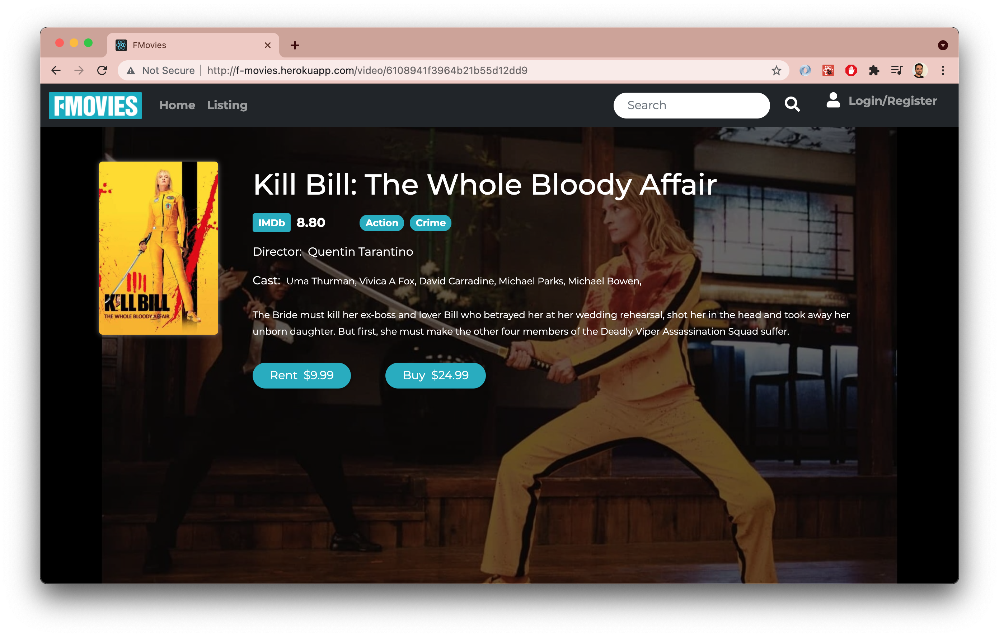

Hosted Demo: <h2>http://f-movies.herokuapp.com/</h2>

This application demonstrates Frontend using React Framework.
Styling done using Bootstrap.

This Project uses modern React concepts and practices including 
- Components (Function based) & Props
- React Router
- State Hooks
- ContextAPI for data propagation (instead of "Prop drilling")

Screenshots:

Backend is another Springboot project (check my Repositories for the Springboot project) hosted on Heroku, whose APIs are being called in this app!

NOTE: Both projects are hosted on Heroku, so it may take up a few minutes for the webiste to load the first time.
